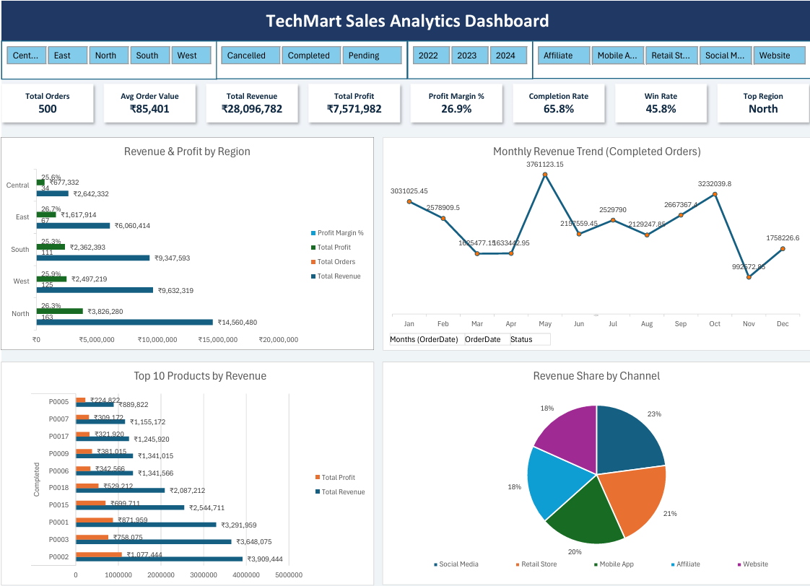

# 📊 TechMart Sales Analytics — MIS Dashboard


> A comprehensive **Management Information System (MIS)** for TechMart, a technology products retailer operating across India. This project covers end-to-end sales analytics — from raw transaction data to business intelligence insights across customers, products, regions, and sales teams.

---

## 📌 Table of Contents

- [Project Overview](#project-overview)
- [Business Problem](#business-problem)
- [Dataset Description](#dataset-description)
- [Key Metrics & Insights](#key-metrics--insights)
- [Project Structure](#project-structure)
- [Tools & Technologies](#tools--technologies)
- [How to Use](#how-to-use)
- [Skills Demonstrated](#skills-demonstrated)
- [Author](#author)

---

## 🧭 Project Overview

TechMart Sales Analytics is a data-driven MIS project that consolidates **500+ orders**, **500 customers**, **500 products**, and **50 sales representatives** into a single unified analytics system. The project is designed to help business managers track performance, identify growth opportunities, and make informed decisions.



| Metric | Value |
|--------|-------|
| 💰 Total Net Sales | ₹4.22 Crore |
| 📈 Total Profit | ₹1.09 Crore |
| 🛒 Total Orders | 500 |
| 👥 Total Customers | 500 |
| 📦 Total Products | 500 |
| 🧑‍💼 Sales Representatives | 50 |
| 🗺️ Regions Covered | 5 (North, South, East, West, Central) |

---

## ❓ Business Problem

Modern retail businesses generate vast amounts of data across sales, customers, products, and teams — but struggle to extract actionable insights. This project addresses:

- **Which regions and channels drive the most revenue?**
- **Which customer segments are most profitable?**
- **Which products and categories perform best?**
- **How are sales reps performing against their targets?**
- **What is the trend in order status (Completed / Pending / Cancelled)?**

---

## 📂 Dataset Description

The project uses **5 interconnected datasets**:

### 1. `orders.csv` — 500 records | 18 columns
Core transaction data linking customers, products, and sales reps.

| Column | Description |
|--------|-------------|
| `OrderID` | Unique order identifier |
| `CustomerID` | Linked customer |
| `ProductID` | Linked product |
| `SalesRepID` | Assigned sales representative |
| `OrderDate / ShipDate / DeliveryDate` | Order lifecycle dates |
| `Quantity` | Units ordered |
| `UnitPrice` | Price per unit (₹) |
| `Discount` | Discount applied |
| `NetSales` | Revenue after discount |
| `Profit` | Net profit on order |
| `Status` | Completed / Pending / Cancelled |
| `Channel` | Website / Mobile App / Affiliate / Social Media / Retail Store |
| `Region` | North / South / East / West / Central |
| `CustomerRating` | Post-purchase rating (1–5) |

---

### 2. `customers.csv` — 500 records | 14 columns
Customer master data with demographics and segmentation.

| Column | Description |
|--------|-------------|
| `CustomerID` | Unique customer ID |
| `CustomerName` | Full name |
| `Age / Gender` | Demographics |
| `City / State / Region / Pincode` | Location data |
| `JoinDate` | Onboarding date |
| `CustomerSegment` | Enterprise / SMB / Retail |
| `TenureYears` | Years as a customer |

---

### 3. `products.csv` — 500 records | 14 columns
Complete product catalog with pricing and performance data.

| Column | Description |
|--------|-------------|
| `ProductID` | Unique product ID |
| `ProductName` | Product title |
| `Brand` | Brand (Samsung, Apple, Bose, etc.) |
| `Category` | Electronics / Accessories / Storage / Networking |
| `UnitPrice / CostPrice` | Pricing data |
| `GrossMargin` | Profitability percentage |
| `StockQty` | Available inventory |
| `Rating / TotalReviews` | Customer satisfaction |
| `Warranty` | Warranty period |
| `IsActive` | Product availability status |

---

### 4. `sales_reps.csv` — 50 reps | 25 columns
Sales team performance and deal-level data.

| Column | Description |
|--------|-------------|
| `SalesRepID / RepName` | Rep identification |
| `Region` | Assigned territory |
| `Experience` | 0–1 yr / 1–3 yrs / 3–5 yrs / 5–10 yrs / 10+ yrs |
| `Education` | BBA / MBA / B.Tech / M.Com etc. |
| `BaseSalary` | Fixed compensation |
| `CommissionRate / CommissionEarned` | Variable pay |
| `MonthlyTarget / MonthlyAchieved` | Target vs. actuals |
| `AttainmentPct` | Achievement percentage |
| `PerformanceRating` | Manager rating |
| `DaysToClose` | Sales cycle length |

---

### 5. `TechMart_Sales_Analytics.xlsx` — Master Workbook
Consolidated Excel workbook containing all datasets, pivot tables, and dashboards built for management reporting.

---

## 📊 Key Metrics & Insights

### 🗺️ Regional Performance
- **5 Regions**: North, South, East, West, Central
- Sales tracked per region with customer base spread across major Indian cities including Mumbai, Delhi, Bangalore, Chennai, Hyderabad, and more.

### 🛒 Sales Channels
| Channel | Type |
|---------|------|
| Website | Digital |
| Mobile App | Digital |
| Affiliate | Partner |
| Social Media | Digital Marketing |
| Retail Store | Physical |

### 👥 Customer Segments
| Segment | Profile |
|---------|---------|
| **Enterprise** | Large organizations, high-value accounts |
| **SMB** | Small & medium businesses |
| **Retail** | Individual consumers |

### 📦 Product Categories
- **Electronics** — Core product line (TVs, audio, accessories)
- **Accessories** — Peripherals and add-ons
- **Storage** — Hard drives, SSDs, memory cards (SanDisk, WD, Samsung)
- **Networking** — Connectivity devices

### 📋 Order Status Tracking
| Status | Description |
|--------|-------------|
| ✅ Completed | Successfully delivered |
| ⏳ Pending | In transit or processing |
| ❌ Cancelled | Order cancelled |

---

## 🗂️ Project Structure

```
TechMart-Sales-Analytics/
│
├── 📊 TechMart_Sales_Analytics.xlsx   # Master Excel MIS workbook
│
├── 📁 data/
│   ├── customers.csv                  # Customer master data (500 records)
│   ├── orders.csv                     # Transaction data (500 orders)
│   ├── products.csv                   # Product catalog (500 products)
│   └── sales_reps.csv                 # Sales team data (50 reps)
│
└── README.md                          # Project documentation
```

---

## 🛠️ Tools & Technologies

| Tool | Purpose |
|------|---------|
| **Microsoft Excel** | MIS dashboard, pivot tables, charts |
| **Python (Pandas)** | Data cleaning and transformation |
| **CSV / Structured Data** | Raw data storage and portability |
| **Data Modeling** | Relational linking across 5 datasets |

---

## 🚀 How to Use

### Option 1 — View Excel Dashboard
1. Open `TechMart_Sales_Analytics.xlsx` in Microsoft Excel
2. Navigate through the sheets: `customers`, `orders`, `products`, `sales_reps`
3. Use pivot tables and filters to explore insights
   
---

## 💼 Skills Demonstrated

This project showcases the following skills relevant for **Data Analyst / Business Analyst / MIS roles**:

- ✅ **Data Modeling** — Designed relational structure across 5 linked datasets
- ✅ **Business Intelligence** — Built KPI dashboards for sales, revenue, and profitability
- ✅ **Customer Analytics** — Segmentation analysis (Enterprise / SMB / Retail)
- ✅ **Product Analytics** — Category and brand performance tracking
- ✅ **Sales Performance** — Rep-level target vs. achievement analysis
- ✅ **Regional Analysis** — Multi-region sales breakdown across India
- ✅ **Excel MIS Reporting** — Professional pivot tables, charts, and dashboards
- ✅ **Data Cleaning** — Handling missing values, date formatting, type normalization

---

## 👤 Author

**Shoaib Alam**
📧 shoaibalam7459@gmail.com
🔗 https://www.linkedin.com/in/shoaib-alam74/

**[Shoaib Alam]**
📧 [shoaibalam7459@gmail.com]
🔗 [https://www.linkedin.com/in/shoaib-alam74/]

---

> ⭐ *If you found this project useful, please give it a star!*
